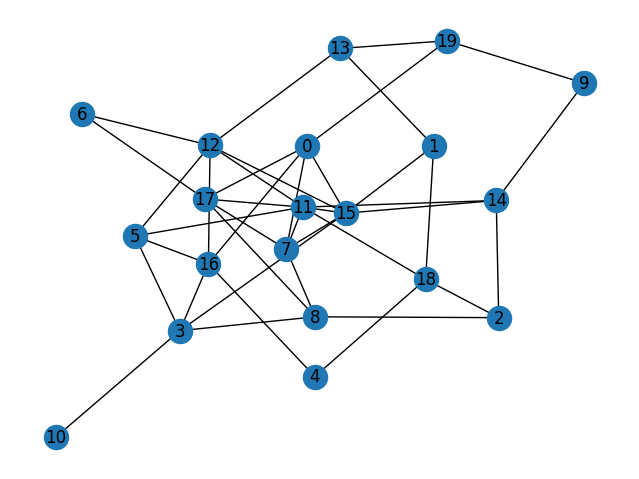
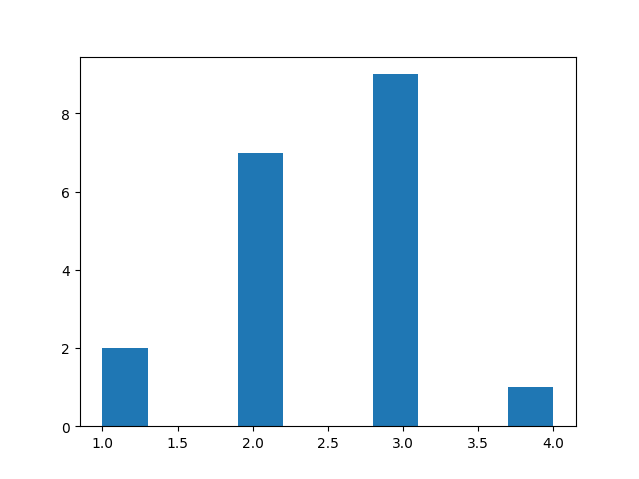
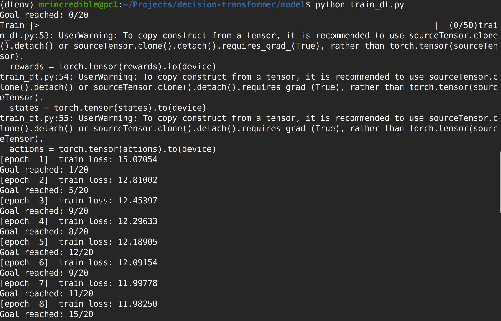

## Replicating Decision Transformer on Graph Random Walk Data

The goal of this task was to replicate the decision transformer on random walk data on a graph.  The decision transformer is a sequence model for offline reinforcement learning, in which the model predicts action at time step t based on the rewards-to-go and state at time t and previous actions, rewards-to-go, and states.  The goal of the decision transformer is to find the shortest path from any starting node to a fixed target node.

First, a random simple connected graph with 20 nodes and an edge sparsity coefficient of 0.1 was generated.  The graph used for this particular task is shown below.

The target node for the task was chosen to be node 4.  This led to a distribution of shortest path lengths between 1 and 4.  The distribution of shortest path lengths is shown below.

Next random walk data was generated on the graph in order to train the decision transformer model.  Each random walk trajectory has a length of 10.  The rewards were defined as follows.  If the random walk trajectory does not reach the target node, then the reward is negative infinity.  Otherwise, the reward at each node that is not the target node is -1 and the reward at the target node is 0.  The action space of the graph are the nodes, and the dynamics is movement to the node if there is an edge connecting the current node to the node specified by the action, or no movement otherwise.  1000 random walk trajectories were generated.

A decision transformer was then trained on the random walk trajectories.  The decision transformer is a vanilla encoder transformer with a causal attention mask.  The transformer was trained with the Adam optimizer with a learning rate of 1e-3 and a decay rate of 1e-4.  In order to test the decision transformer, we test whether the decision transformer is able to find a shortest path trajectory from each node in the graph to the target node.  The decision transformer was seeded with the state as the starting node a rewards-to-go corresponding to the shortest path from the starting node to the target node.  We then count how many nodes the decision transformer succeeds in finding the shortest path to the target node.  As we see in the figure below, the decision transformer was able to find the shortest path for 15 out of 20 nodes in the graph within 8 epochs of training on the random walk trajectories data.

